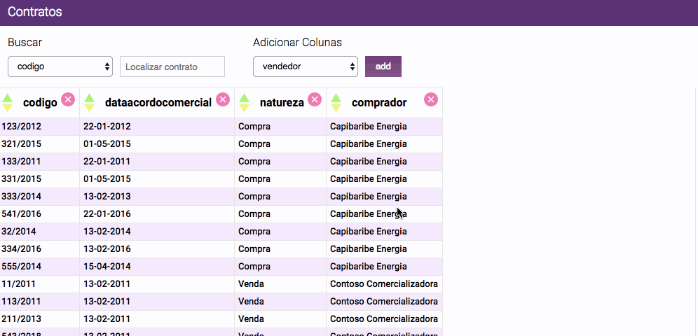

# Lista de Contratos

> :cyclone: :raising_hand: Este projeto é apenas para fins de processo seletivo para a vaga de Engenheiro de Software Front-End.

## Acesse [o projeto online](https://simoneas02.github.io/contracts-list/)


## Inicie o projeto localmente

**0 -** instale as dependências básicas

- [NodeJS](https://nodejs.org/en/)
- [Stylus](http://stylus-lang.com/) - `npm install stylus -g`

**1 -** Clone o projeto e instale as dependências:

```sh
$ git clone https://github.com/simoneas02/contracts-list
$ cd contracts-list/
$ npm install
```

**2 -** Inicie o ambiente de desenvolvimento:

```sh
$ npm start
```
## Tarefas Automatizadas

- `$ npm start` - Inicia o modo de desenvolvimento
- `$ npm run build` - Gera um build otimizado para produção
- `$ npm run deploy` - Automatiza o deploy para Github Pages

## Stack

* [React](https://facebook.github.io/react/)
* [Stylus](http://stylus-lang.com/)
* [webpack](https://webpack.github.io/)
* [Babel](http://babeljs.io/)
* [ESLint](http://eslint.org/)

## Estrutura de Pastas

	.
	├── public/
	|   ├── index.html
	|   ├──	contracts.json
	|   └── main.css
	├── src/
	|   ├── icons/	
	|   ├── main.styl
	|   ├── App.js
	|   ├──ContractRows.js
	|   ├──main.styl
	|   └── index.js
	├── .editorconfig
	├── .gitignore
	├── package.json
	├── CONTRIBUTING.md
	├── LICENSE.md
	└── README.md

## Sobre Contrubuir

Este projeto é apenas para fins de processo seletivo para a vaga de Engenheiro de Software Front-End.

## Licença

[MIT License](https://github.com/simoneas02/contracts-list/blob/master/LICENSE.md) © [Simone Amorim](https://simoneas02.github.io)


